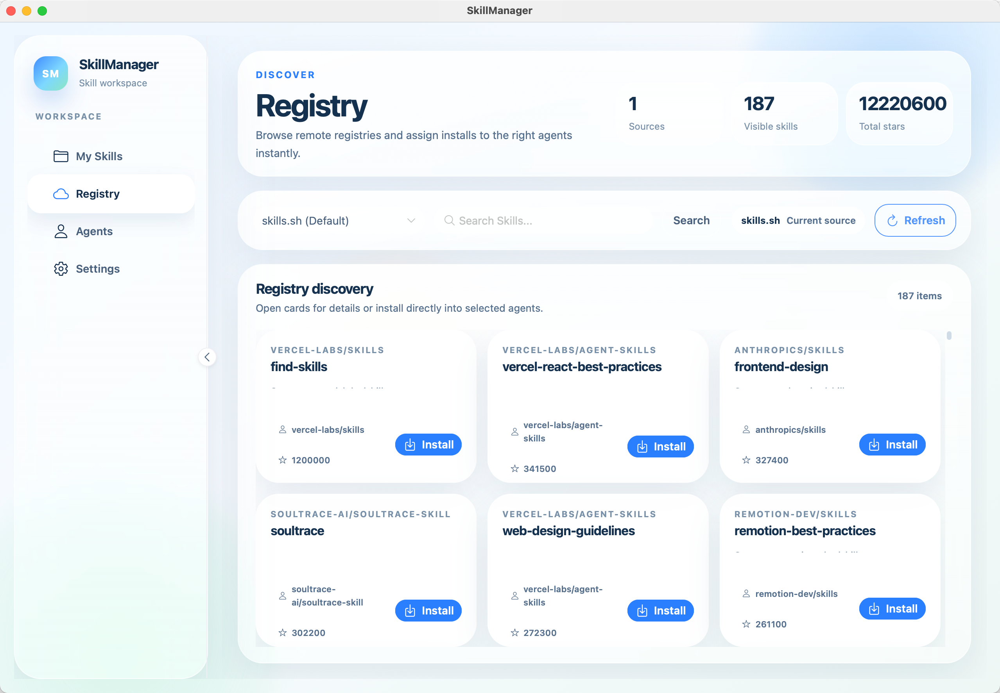
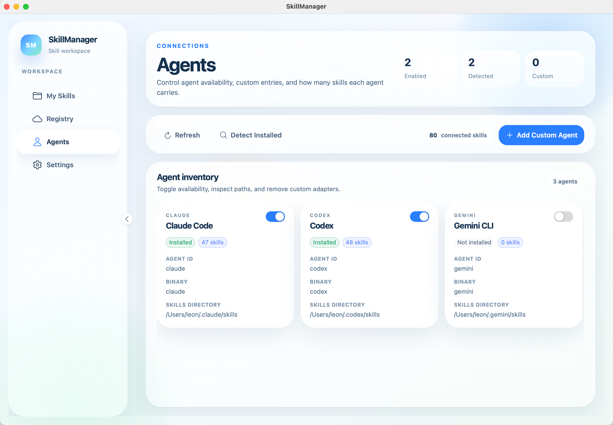
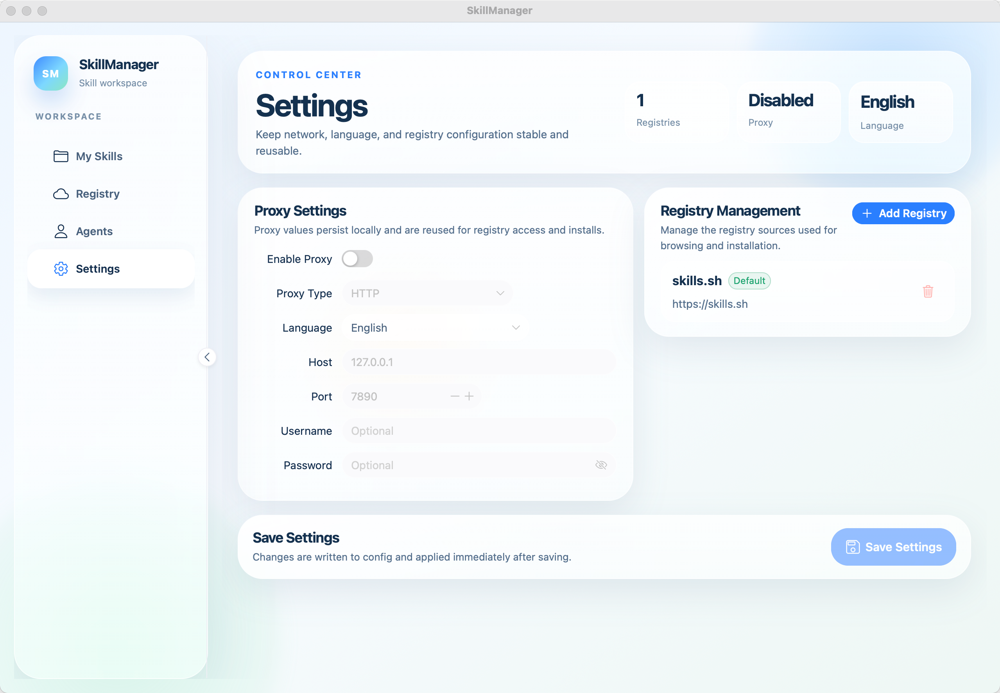

<div align="center">


# SkillManager

**跨平台 AI 编程助手技能管理器**

[English](./README.md) | 简体中文

[](https://go.dev/)
[](https://wails.io/)
[](https://vuejs.org/)
[](LICENSE)
[](https://github.com/eatmoreduck/skillmanager)

</div>

---

## 📖 简介

SkillManager 是一个跨平台桌面应用，用于统一管理多个 AI 编程助手（Claude Code、Gemini CLI、Codex、Cursor、Windsurf 等）的技能文件。

厌倦了在不同工具之间手动复制粘贴 prompt？SkillManager 帮你：

- 🔄 **一键同步** - 在多个 AI 助手之间共享技能
- 📦 **集中管理** - 统一管理所有技能的安装、更新、删除
- 🔍 **技能发现** - 从注册表发现和安装社区技能
- 📊 **状态监控** - 查看每个助手可见的技能清单

## 📸 截图

| 我的技能 | 仓库 |
|----------|------|
|  |  |

| 代理 | 设置 |
|------|------|
|  |  |

## 🚀 快速开始

### 下载安装

从 [Releases](https://github.com/eatmoreduck/skillmanager/releases) 页面下载适合你系统的版本。

### 从源码构建

```bash
# 克隆仓库
git clone https://github.com/eatmoreduck/skillmanager.git
cd skillmanager

# 安装依赖
go mod download
cd frontend && npm install && cd ..

# 开发模式运行
task dev

# 构建生产版本
task build
```

### 命令行使用

```bash
# 完整诊断报告
skillmanager doctor

# 查看已配置的 AI 助手
skillmanager agents

# 查看技能清单
skillmanager skills

# 查看配置摘要
skillmanager config
```

## 🏗️ 技术架构

```
┌─────────────────────────────────────────────────────────┐
│                    Frontend (Vue 3)                      │
│  ┌─────────┐ ┌─────────┐ ┌─────────┐ ┌─────────┐       │
│  │  Views  │ │Components│ │ Stores  │ │ Router  │       │
│  └────┬────┘ └─────────┘ └────┬────┘ └─────────┘       │
│       │         Pinia         │                          │
│       └───────────────────────┘                          │
└─────────────────────────┼───────────────────────────────┘
                          │ Wails Bindings
                          ▼
┌─────────────────────────────────────────────────────────┐
│                    Backend (Go)                          │
│  ┌─────────┐ ┌─────────┐ ┌─────────┐ ┌─────────┐       │
│  │ Binding │ │ Service │ │  Repo   │ │  Model  │       │
│  └────┬────┘ └────┬────┘ └────┬────┘ └─────────┘       │
│       └───────────┴───────────┘                          │
└─────────────────────────────────────────────────────────┘
```

### 后端架构

| 层级 | 目录 | 职责 |
|------|------|------|
| Binding | `internal/binding/` | Wails 绑定，暴露服务给前端 |
| Service | `internal/service/` | 业务逻辑层 |
| Repository | `internal/repository/` | 数据访问层 |
| Model | `internal/model/` | 领域模型 |

### 前端架构

| 目录 | 职责 |
|------|------|
| `views/` | 页面组件 |
| `components/` | 可复用组件 |
| `stores/` | Pinia 状态管理 |
| `types/` | TypeScript 类型定义 |

## ⚙️ 配置

配置文件存储位置：

| 平台 | 路径 |
|------|------|
| macOS | `~/Library/Application Support/skillmanager/config.yaml` |
| Linux | `~/.config/skillmanager/config.yaml` |
| Windows | `%APPDATA%\skillmanager\config.yaml` |

可通过 `SKILLMANAGER_CONFIG` 环境变量覆盖默认路径。

## 🤝 参与贡献

欢迎提交 Pull Request！

## 📄 许可证

本项目基于 MIT 许可证开源 - 详见 [LICENSE](LICENSE) 文件。

---

<div align="center">

Made with ❤️ by [eatmoreduck](https://github.com/eatmoreduck)

</div>
