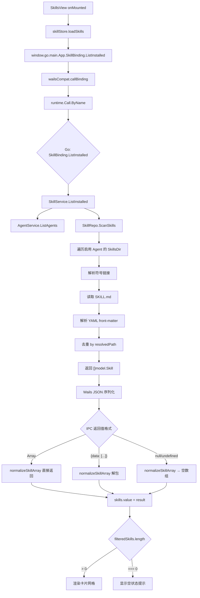
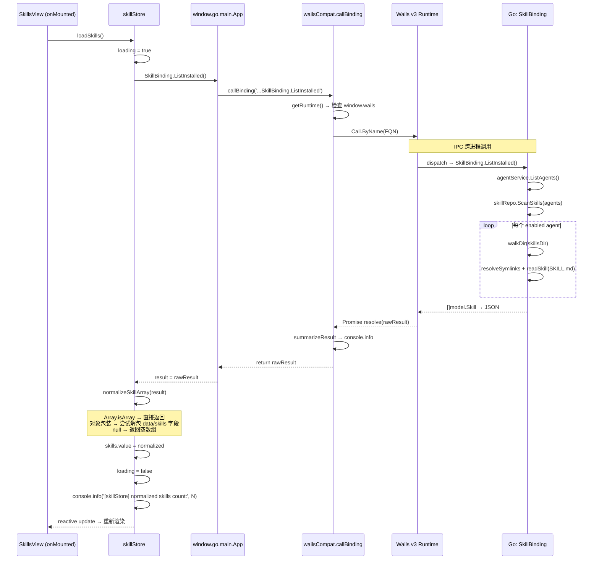

# Design: fix-skill-list-blank-display

## 组件架构

```
SkillsView.vue (页面容器)
├── page-hero (统计面板)
│   ├── hero-copy (标题区)
│   └── hero-stats (3 列统计)
│       ├── skillCount (已安装技能数)
│       ├── assignedAgentCount (关联 Agent 数)
│       └── tagCount (标签总数)
├── glass-panel.toolbar-panel (搜索栏)
│   ├── n-input.search-input (搜索框)
│   └── badge-chip (结果计数)
├── n-alert (错误提示, v-if="skillStore.error")
├── state-surface (加载中, v-if="loading")
│   └── n-spin
├── state-surface (空状态, v-else-if="filteredSkills.length === 0")
│   └── n-empty
└── glass-panel.content-surface (内容区, v-else)
    ├── section-bar (区段标题)
    └── skills-grid (CSS Grid)
        └── SkillCard × N (v-for)
            ├── card-header (头像 + 名称 + 版本)
            ├── skill-description (描述文本)
            ├── skill-metrics (Agent/标签计数)
            ├── skill-tags (标签列表)
            └── card-footer (安装时间 + Agent 图标)
```

### 数据流分层

```
┌─────────────────────────────────────────────────────────────────────┐
│                         Presentation Layer                         │
│  SkillsView.vue → SkillCard.vue                                     │
│  - v-for="skill in filteredSkills"                                  │
│  - :key="skill.id" :skill="skill"                                   │
├─────────────────────────────────────────────────────────────────────┤
│                          Store Layer                                │
│  skillStore.ts (Pinia)                                              │
│  - loadSkills() → normalizeSkillArray(result)                       │
│  - skills: ref<Skill[]>                                             │
│  - filteredSkills: computed (in SkillsView)                         │
├─────────────────────────────────────────────────────────────────────┤
│                        Bridge Layer                                 │
│  wailsCompat.ts                                                     │
│  - window.go.main.App.SkillBinding.ListInstalled()                  │
│  - callBinding() → runtime.Call.ByName(FQN)                         │
├─────────────────────────────────────────────────────────────────────┤
│                        Runtime Layer                                │
│  @wailsio/runtime (v3)                                              │
│  - Call.ByName → IPC message → Go dispatcher                       │
│  - Promise resolution with deserialized JSON                        │
├─────────────────────────────────────────────────────────────────────┤
│                         Backend Layer                               │
│  SkillBinding.ListInstalled() → SkillService → SkillRepo.ScanSkills │
│  - []model.Skill → JSON serialization → IPC response                │
└─────────────────────────────────────────────────────────────────────┘
```

## 数据流图



## API 调用时序图



## 详细代码变更清单

### 1. `frontend/src/stores/skillStore.ts`

**变更类型**：修改

**新增函数 `normalizeSkillArray`**：
```typescript
function normalizeSkillArray(data: unknown): Skill[] {
  if (Array.isArray(data)) return data
  if (data && typeof data === 'object') {
    const obj = data as Record<string, unknown>
    for (const key of ['data', 'skills', 'result', 'items']) {
      if (Array.isArray(obj[key])) return obj[key] as Skill[]
    }
    if (typeof obj.id === 'string' && typeof obj.name === 'string') {
      return [obj as unknown as Skill]
    }
  }
  return []
}
```

**修改 `loadSkills`**：
- 替换 `skills.value = result || []` 为 `skills.value = normalizeSkillArray(result)`
- 添加 `console.info('[skillStore] ListInstalled raw result:', typeof result, Array.isArray(result), result)`
- 添加 `console.info('[skillStore] normalized skills count:', skills.value.length)`
- 添加 `console.error('[skillStore] ListInstalled failed:', e)` 在 catch 中

### 2. `frontend/src/views/SkillsView.vue`

**变更类型**：修改

**修改 `filteredSkills` computed**：
```typescript
const filteredSkills = computed(() => {
  const all = Array.isArray(skillStore.skills) ? skillStore.skills : []
  if (!searchQuery.value) return all
  const query = searchQuery.value.toLowerCase()
  return all.filter(skill =>
    (skill.name || '').toLowerCase().includes(query) ||
    (skill.description || '').toLowerCase().includes(query) ||
    normalizedTags(skill.tags).some(tag => tag.toLowerCase().includes(query))
  )
})
```

**修改 `assignedAgentCount` 和 `tagCount` computed**：
- 添加 `Array.isArray(skillStore.skills)` 防御检查
- 空值保护 `skill.agents || []` 和 `normalizedTags(skill.tags)`

**修改 `filteredSkills` filter 回调**：
- `(skill.name || '')` 和 `(skill.description || '')` 空值保护

## 渲染条件决策树

```
skillStore.loading?
├── true  → 渲染 <n-spin> (加载中)
└── false → filteredSkills.length === 0?
            ├── true  → 渲染 <n-empty> (空状态)
            └── false → 渲染 <section.content-surface>
                        └── <div.skills-grid>
                            └── <SkillCard v-for="skill in filteredSkills">

附加条件（独立于上述分支）:
skillStore.error? → 渲染 <n-alert type="error"> (顶部错误提示)
```

## 关键约束

1. **最小变更原则**：仅修改数据接收层，不触碰后端、不改变组件结构
2. **防御性编程**：`normalizeSkillArray` 对任何输入类型都有明确的处理路径
3. **可观测性**：`console.info` 日志清晰记录原始数据类型和归一化结果
4. **向后兼容**：当 Wails v3 返回标准数组时，`normalizeSkillArray` 透传不做额外处理
5. **无副作用**：修改不影响 `getSkillDetail`、`installSkill`、`uninstallSkill` 等其他 store 方法

## 实现确认

代码修改已落地到以下文件，与设计规格完全匹配：

- `frontend/src/stores/skillStore.ts`（第 9-28 行 `normalizeSkillArray`，第 41-55 行 `loadSkills`）
- `frontend/src/views/SkillsView.vue`（第 175-194 行三个 computed 属性）

自动化验证结果：
- `vue-tsc --noEmit`：零错误
- `vite build`：2.66s 成功
- `go test ./internal/...`：全部 PASS
