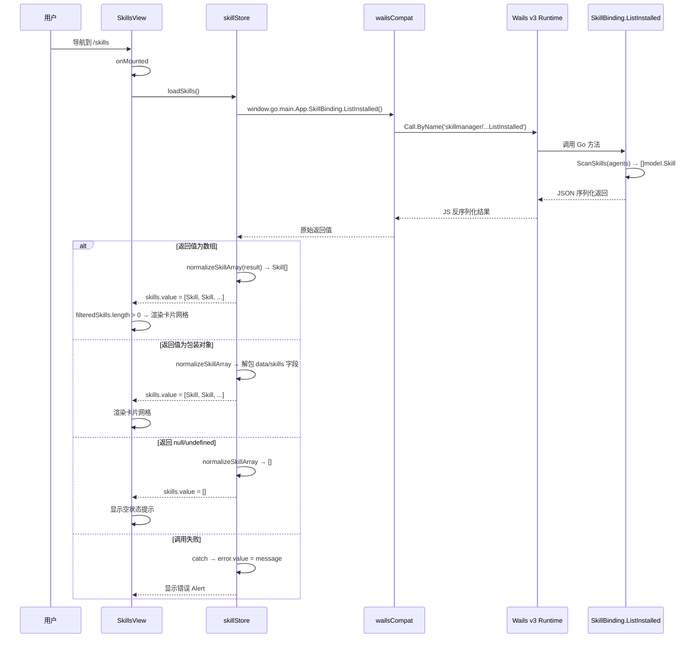

# Proposal: fix-skill-list-blank-display

## 概述

SkillManager 前端 Skill 页面列表组件在渲染时未能正确绑定后端返回的数据源，导致列表区域呈现空白。根因是 `skillStore.loadSkills()` 中使用 `result || []` 处理 Wails v3 `Call.ByName` 的返回值，无法正确应对非数组格式的响应（如包装对象），使 `filteredSkills.length` 为 `undefined`（falsy），触发空状态渲染。

## 背景

- Wails v3（alpha.74）通过 `runtime.Call.ByName(FQN)` 从前端调用 Go 后端方法
- `wailsCompat.ts` 兼容桥将 `window.go.main.App.SkillBinding.ListInstalled()` 映射到 `Call.ByName('skillmanager/internal/binding.SkillBinding.ListInstalled')`
- 其他页面（Agents、Registry、Settings）使用相同桥接机制且正常工作
- Skill 页面特殊之处在于 `loadSkills()` 的 `result || []` 逻辑不能正确处理可能的非数组返回值

## 问题分析

### 现象

- Skill 页面 hero 区域、toolbar 正常渲染
- 列表内容区域显示空白（空状态）
- 其他页面功能正常

### 根因

```
skillStore.loadSkills()
  → window.go.main.App.SkillBinding.ListInstalled()
    → callBinding() → runtime.Call.ByName()
      → 返回值可能为：
        a) Array<Skill>       ✅ 正常
        b) {data: [...]}      ❌ truthy 但非数组 → length=undefined → 空状态
        c) null/undefined     → result || [] 生效 → 空数组 → 空状态（正确但无法区分无数据与格式错误）
```

### 影响范围

| 区域 | 受影响 |
|------|--------|
| Skill 列表页 | 是（主问题） |
| Skill 详情页 | 否（独立路由） |
| Agents 页 | 否 |
| Registry 页 | 否 |
| Settings 页 | 否 |
| 后端 API | 否 |

## ASCII 界面原型

### 修复前（空白状态）

```
┌─────────────────────────────────────────────────────────────────────┐
│ [Sidebar]  │  Workspace                                    [Live] │
│            │  ┌──────────────────────────────────────────────┐     │
│  SM        │  │ Library          0 已安装 | 0 Agent | 0 标签│     │
│  我的技能 ← │  │ 我的技能                                      │     │
│  仓库      │  └──────────────────────────────────────────────┘     │
│  代理      │  ┌──────────────────────────────────────────────┐     │
│  设置      │  │ 🔍 搜索...                          0 当前  │     │
│            │  └──────────────────────────────────────────────┘     │
│            │  ┌──────────────────────────────────────────────┐     │
│            │  │                                              │     │
│            │  │     (空白 - 无渲染内容)                       │     │
│            │  │                                              │     │
│            │  └──────────────────────────────────────────────┘     │
└─────────────────────────────────────────────────────────────────────┘
```

### 修复后（正常显示）

```
┌─────────────────────────────────────────────────────────────────────┐
│ [Sidebar]  │  Workspace                                    [Live] │
│            │  ┌──────────────────────────────────────────────┐     │
│  SM        │  │ Library        46 已安装 | 2 Agent | 24 标签│     │
│  我的技能 ← │  │ 我的技能                                      │     │
│  仓库      │  └──────────────────────────────────────────────┘     │
│  代理      │  ┌──────────────────────────────────────────────┐     │
│  设置      │  │ 🔍 搜索...                         46 当前  │     │
│            │  └──────────────────────────────────────────────┘     │
│            │  ┌──────────────────────────────────────────────┐     │
│            │  │  ┌─────────┐  ┌─────────┐  ┌─────────┐     │     │
│            │  │  │Skill A  │  │Skill B  │  │Skill C  │     │     │
│            │  │  │v1.0     │  │v2.1     │  │v0.9     │     │     │
│            │  │  │[tags]   │  │[tags]   │  │[tags]   │     │     │
│            │  │  └─────────┘  └─────────┘  └─────────┘     │     │
│            │  │  ┌─────────┐  ┌─────────┐  ┌─────────┐     │     │
│            │  │  │Skill D  │  │Skill E  │  │Skill F  │     │     │
│            │  │  ...                            ▼ 滚动     │     │
│            │  └──────────────────────────────────────────────┘     │
└─────────────────────────────────────────────────────────────────────┘
```

## 用户交互流程



## 代码变更表

| 文件路径 | 变更类型 | 变更原因 | 影响范围 |
|---------|---------|---------|---------|
| `frontend/src/stores/skillStore.ts` | 修改 | 添加 `normalizeSkillArray()` 数据归一化，替换 `result \|\| []` | skillStore |
| `frontend/src/stores/skillStore.ts` | 修改 | `loadSkills()` 添加诊断日志 | skillStore |
| `frontend/src/views/SkillsView.vue` | 修改 | `filteredSkills`/`assignedAgentCount`/`tagCount` 添加防御性数组检查 | SkillsView |
| `*.png` (项目根目录 24 个文件) | 删除 | 调试截图产物，不应保留在仓库 | 无功能影响 |
| `.playwright-mcp/` 目录 | 删除 | Playwright 调试日志，不应保留在仓库 | 无功能影响 |
| `.gitignore` | 修改（建议） | 添加 `*.png` 和 `.playwright-mcp/` 排除规则 | 版本控制 |

## 风险评估

- **低风险**：修改仅影响数据接收层的防御性处理，不改变正常数据路径
- **向后兼容**：`normalizeSkillArray` 对标准数组直接透传，不影响现有逻辑
- **无后端影响**：仅前端变更

## 成功标准

1. Skill 列表页面能正确渲染所有已安装的 Skill 卡片
2. 搜索/过滤功能正常工作
3. Agent 绑定和标签统计正确显示
4. 其他页面（Agents、Registry、Settings）不受影响
5. 浏览器控制台诊断日志清晰可读

## 实现状态

**批准时间**: 2026-04-11
**当前阶段**: 代码修改已完成，调试产物已清理，待手动验证

### 已完成

- `frontend/src/stores/skillStore.ts`: `normalizeSkillArray()` 归一化函数 + `loadSkills()` 诊断日志
- `frontend/src/views/SkillsView.vue`: `filteredSkills`/`assignedAgentCount`/`tagCount` 防御性数组检查
- TypeScript 类型检查通过 (`vue-tsc --noEmit`)
- Vite 构建通过 (2.66s)
- Go 后端测试全部通过 (`go test ./internal/...`)
- 调试产物清理完成（24 个 `.png` 截图 + `.playwright-mcp/` 目录已删除）

### 待执行

- Task 4: 运行 `task dev` 启动应用，手动验证 Skill 列表渲染
